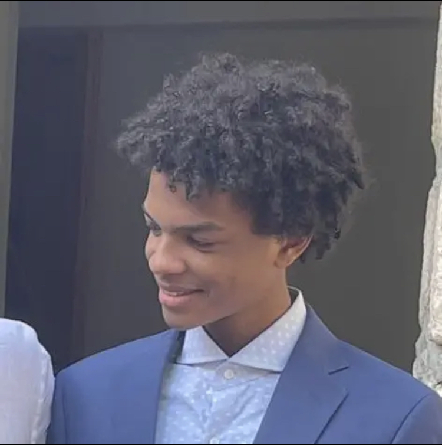

# 👋 Hey, my name is Therry

- ***Programming Language***

  * Familiar with **C**. Learning **Lua** and **To Build an Os**. Already learned **Git**, **C++**, **Go** but I don't realy use them, Knows **Python**, **SQL**, and **Java** but I don't like them.

- ***Daily Tools***

  * Can adapt to any editor (except emacs lol). Daily using neovim under ZorinOS (free version).

- ***Work Experience***

  * Still a student.

- ***Contact Me***

  * Email: [`therryleseul@gmail.com`](mailto:therryleseul@gmail.com)

## Stats

