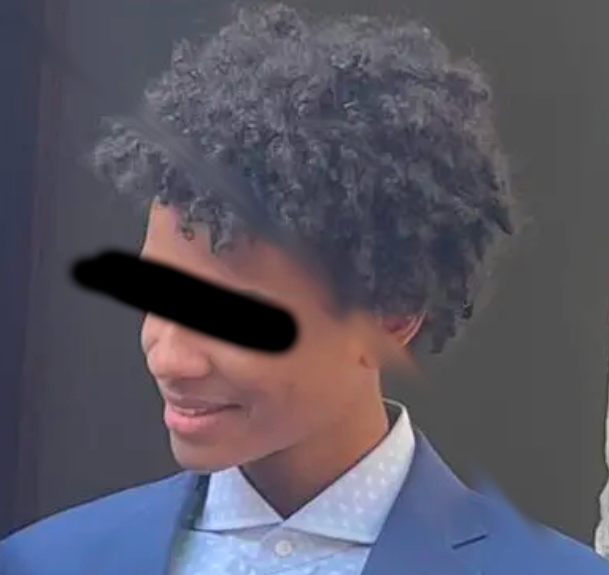

# 👋 Hey, my name is Therry

- ***Programming Language***

  * Familiar with **C**, **C++** and **Python**. 
  
- ***Current Project***

  * I stopped because of school.

- ***Daily Tools***

  * Can adapt to any editor. Daily using Neovim under Pop!_OS.

- ***Work Experience***

  * Still a student.

- ***Contact Me***

  * Email: [`therryleseul@gmail.com`](mailto:therryleseul@gmail.com)

## Stats

